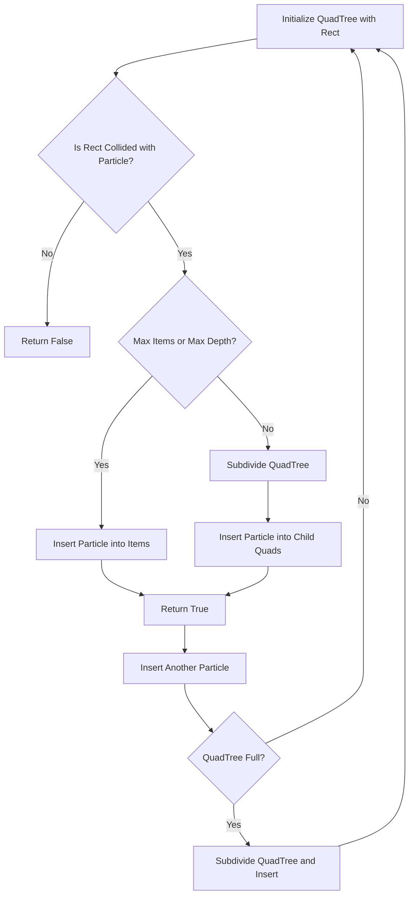

# How it works

Quadtree, basically instead of looping over each things, we group them into boxes and loop over the boxes instead. It ebbs the pain over having to check each one, checking box groups lessen the pain.

## Some maths to prove it

Sure! Let’s analyze and compare the number of collision checks needed in both the naïve approach and the quadtree-based approach.

### Naïve Approach (Brute Force)
In the naïve approach, each particle is compared with every other particle. Given **N** particles, the total number of comparisons is:

$$C_{\text{naive}} = \frac{N (N - 1)}{2}$$

For example, if \( N = 10 \):

$$C_{\text{naive}} = \frac{10 \times 9}{2} = 45 \text{ checks}$$

This is **O(N^2)** in complexity, which becomes computationally expensive as \( N \) increases.

---

### Quadtree Approach
A **quadtree** divides the space into **4 equal quadrants** recursively until each quadrant contains at most **M** particles or a maximum depth is reached.

1. **Insertion:** Each particle is placed into the smallest quadrant that contains it.
2. **Querying:** Instead of checking against all **N** particles, we only check particles within the same or neighboring quadrants.

Let’s approximate the number of checks when using a quadtree:

- The space is divided into **4 quadrants** at each level.
- If we assume a balanced distribution, each level reduces the number of potential collision checks by a factor of **4**.
- If a quadtree reaches **D** levels deep, the number of particles per quadrant is roughly \( N / 4^D \).

The **collision check complexity** can be approximated as:

$$C_{\text{quadtree}} = O(N \log N)$$

For **N = 10**, assuming **depth = 2**, each region contains at most **M = 4** particles. In this case, we only need to check within these small regions rather than across all particles.

Instead of **45 checks**, we now have:

$$\approx M \times \text{number of regions} = 4 \times 4 = 16 \text{ checks}$$

---

### Comparison of Complexity
| Number of Particles \( N \) | Naïve Checks \( O(N^2) \) | Quadtree Checks \( O(N \log N) \) |
|------------------|------------------|----------------------|
| 10              | 45               | ~16                 |
| 100             | 4,950            | ~200                |
| 1,000           | 499,500          | ~3,000              |

As \( N \) grows, the quadtree provides an **exponential reduction** in the number of collision checks, making it significantly more efficient.

## 1. **Start with a Big Rectangle (Root Quad)**

- You initialize the **root quadtree** with a large bounding rectangle. This is the whole area that the quadtree covers at the highest level.

## 2. **Inserting Particles**

- You insert particles (or objects) into the quadtree, checking if they fall within the bounds of the root rectangle.

## 3. **Subdivide When Exceeding the Max Item Limit**

- If the **number of particles** in the current quadrant (node) exceeds a specified **max item limit** (e.g., 4), the node will subdivide into **4 smaller quadrants** (children), each representing a region of the original rectangle.
- At this point, particles need to be redistributed into these smaller child quadrants.

## 4. **Subdivide Recursively for Each Child Node**

- Each child node is treated as a new rectangle. If a child node has more particles than it can hold (exceeds the max limit), it will **subdivide further** into smaller quadrants.
- The process repeats recursively for every child node, and each new subdivision keeps track of its **level** (depth) in the quadtree. This is the idea of **depth** in a tree structure: a node that is subdivided is considered at a "lower level" or "deeper" in the tree.

## 5. **Maximum Depth Restriction**

- When the quadtree reaches the **max depth** (e.g., level 6), further subdivision **stops**. Even if the node holds too many particles, no more subdivisions happen past this depth. Instead, the node will continue holding the particles without further subdividing.

## 6. **Why This Is Better Than Looping Through Every Particle**

- **Efficiency**: The core benefit of using a quadtree is that you don’t need to check all particles for collisions or interactions. Instead, you focus on smaller regions (quadrants) by **looping over the quadtree nodes**, which helps reduce the number of checks significantly.
- **Reduction of Candidates**: Instead of checking every particle in the entire space, the quadtree helps **filter down the potential candidates** for interaction by grouping particles into manageable regions (quads). By doing this, you're only interacting with the particles in relevant quadrants, which is **faster** than comparing every particle to every other one.

## Recap:

- **Big rect** → Insert particles.
- **Exceed max items?** → Subdivide into 4 smaller rectangles (child nodes).
- For each child, **check again**: If too many particles, subdivide further; if not, claim the particles.
- **Depth limit** (e.g., level 6): No more subdivisions, just hold the particles.
- **Efficiency**: Quadtree reduces the area you need to check, so you loop over the **quad boxes** (regions) instead of checking every particle individually.

## When to not use this?

Say you have moving against static, then just use moving pos as index, use said index to grab tile quickly from a list or string.

Quadtree is for moving against moving things, where there is no way we can immediately index and get ref to each other with pos alone. See below to when you wanna use it.

## How and why you want this?

So basically helps when we have many to many interaction of moving things. Like if by design player bullets can explodes when in contact with enemies bullets then we should add them as quadtree candidates.

- Enemies bounces off of each other and player, or if not bounce then do something like go to other state.

- If shell casing from a machine gun are supposed to also bounces off of each other use this.

- You get the idea.
